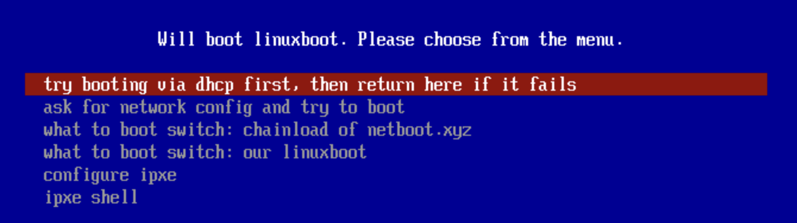
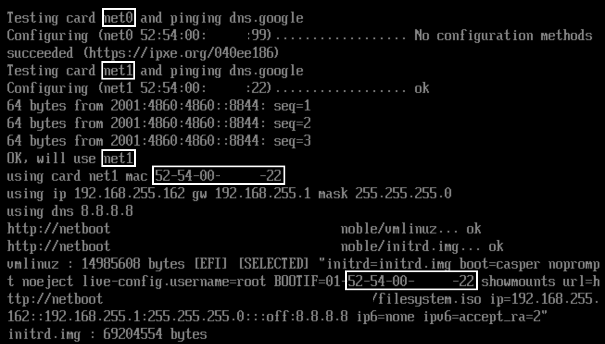
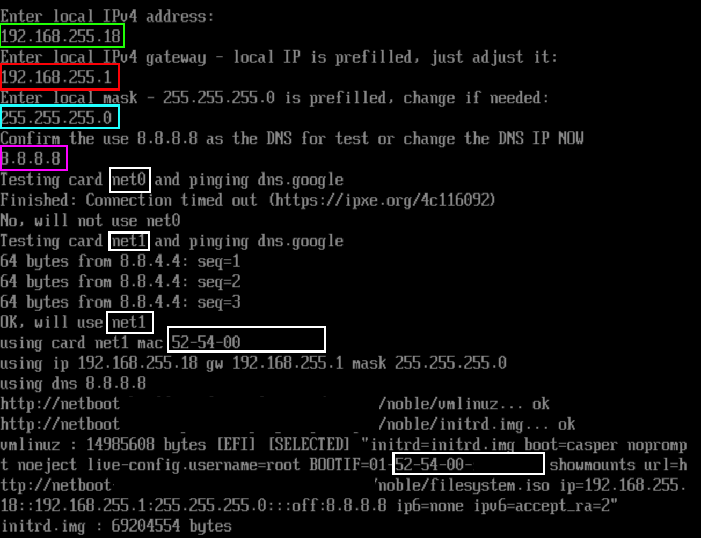

# Build the ipxe images

## Overview

This directory contains all the tooling necessary to build the iPXE images. The scripts build the following iPXE bootable images:

| File                     | Boot Environment     | Purpose/use
|--------------------------|----------------------|---
| `ipxe64.efi`             | UEFI (64 bit)        | To be loaded during [network boot](../network-boot-to-the-rescue.md)
| `undionly.kpxe`          | Legacy               | To be loaded during [network boot](../network-boot-to-the-rescue.md)
| `ipxe-floppy-legacy.img` | Legacy               | Boot floppy
| `ipxe-floppy-uefi.img`   | UEFI(64 bit)         | Boot floppy
| `ipxe-iso-uefi.iso`      | UEFI(64 bit) /Legacy | Hybrid boot ISO

The boot ISO and floppies have the `embed.ipxe` file baked in. The default `embed.ipxe` offers DHCP and static configurations,
so you can load and boot those files on a remote server via IPMI quickly, and the rest will be retrieved from the server directly,
over the network.

## Configure your `embed.ipxe`

There's a sample `embed.example.ipxe`. Copy it to a file named `embed.ipxe` and adjust the `url_prefix` to point to the webserver holding your boot images.

This script assists with running iPXE outside of a typical netboot environment:

- it's capable of trying DHCP over up to five available network cards and tries to find the one with internet connectivity
- it's also capable of requesting IPv4 configs from the operator, trying to find the network card with the provided subnet (again, based on a test of available internet connectivity)

Once the right network card is found, the script loads and attempts to boot the netboot/live image.

The embedded script also supports chainloading of [netboot.xyz](https://netboot.xyz/docs).

An example of the `embed.ipxe` main menu:



An example of the DHCP discovery:



An example of the discovery based on user's input:



## Post-deploy script

You can create a `post-deploy.sh` file, set it as executable, and it will be executed at the end of the build process automatically.
The script can, for example, synchronise the data to the TFTP or HTTP server.

## Build

To build the images, install Docker and `make` and run:

```bash
$ make
```

> [!TIP]
> The build requires privileged Docker containers, otherwise the build tools fail.

We're currently building the images based on a [`master`](https://github.com/ipxe/ipxe) iPXE branch. The images will be placed in the `bin` directory.
