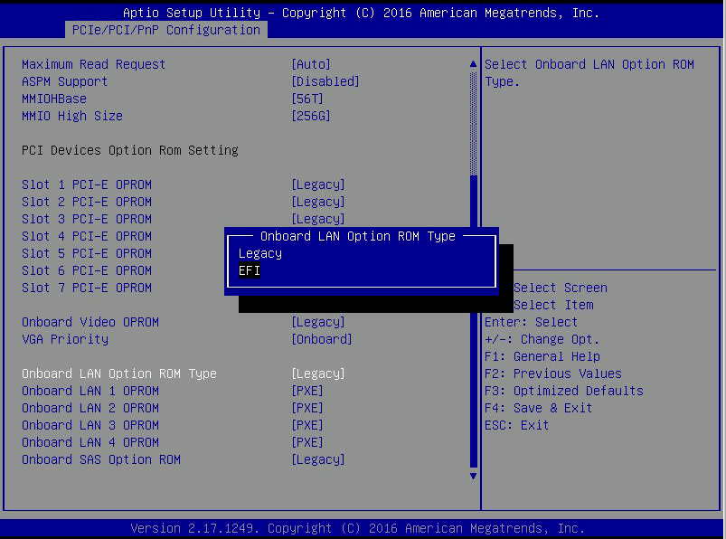
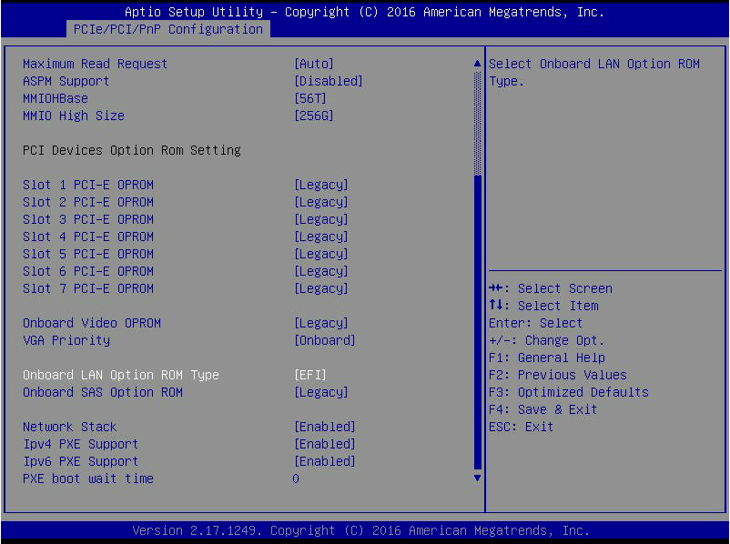
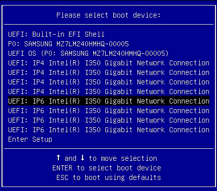
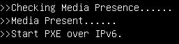
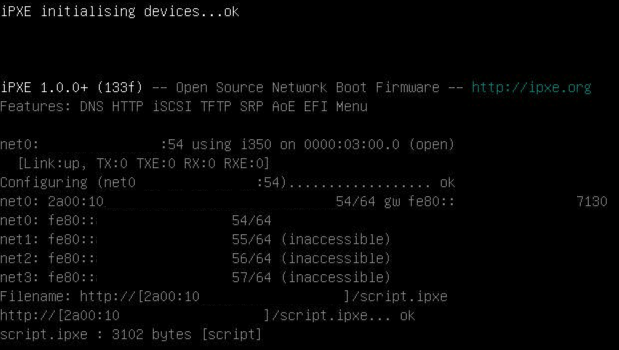
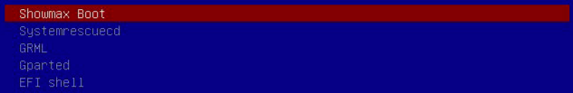
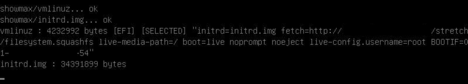
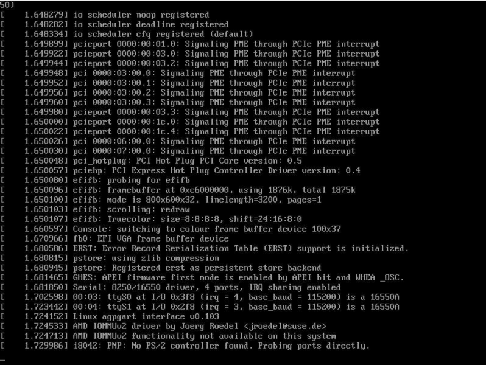

# Network Boot To The Rescue

> [!NOTE]
> This post was originally published on the [Showmax Engineering blog](https://web.archive.org/web/20220707135848/https://showmax.engineering/2019/04/network-boot-to-the-rescue/).
> The blog, and Showmax Engineering in general, is no more, hence republishing the text here.
> This text is highly relevant to the configuration of the network boot environment, should you want to build it on Debian/Ubuntu.

Having a physical infrastructure spread across continents presents you with non-trivial challenges when it comes to maintenance. It’s not always possible to boot your server from a USB stick or even _that ancient spinning optical media technology_, and you also want to be sure that you can reinstall or repair servers with as little physical interaction as possible. Here, I’ll cover how Showmax approaches remote maintenance and how it works end-to-end.

### The Problem

In contrast to current trends, we tend not to use cloud-based services everywhere. This is especially important when it comes to content delivery. Our content delivery network serves users with a better cache hit ratio at a fraction of the price of third-party content delivery services (cloud services are a synonym for _other people's computers_ anyway).

We have dozens of physical servers spread across Africa, and, as with every physical server, these machines need to be put into maintenance mode sometimes -- be it a recovery or reinstallation. In the past, we entered maintenance mode via booting from USB flash drives. But these drives proved to be hard to maintain and often required physical human interaction.

Based on the experience with flash drives, we chose to implement a network boot infrastructure. In this article, I’ll explain how we configure our infrastructure for network boot via UEFI and IPv6, with a demonstration of this configuration on a server booting from a network.

### Network Boot Basics

When your computer powers on, the processor passes execution to a boot program that used to be known as the [Basic Input/Output System](https://en.wikipedia.org/wiki/BIOS) (BIOS) - a system later replaced by a [Unified Extensible Firmware Interface](https://en.wikipedia.org/wiki/Unified_Extensible_Firmware_Interface) (UEFI). This program (in both BIOS and UEFI worlds) is responsible for hardware initialization, connected equipment detection, boot device selection, and the loading of the operating system. The operating system then performs its boot procedure.

When your server is in a good shape, it usually boots from a local disk drive first. If maintenance is needed, the boot device order is temporarily altered and the boot program proceeds with the loading of the operating system from another device. Depending on your boot program, this device can be another hard drive, a USB stick, a HTTP URL, or a file stored on a [Trivial File Transfer Protocol (TFTP) server](https://en.wikipedia.org/wiki/Trivial_File_Transfer_Protocol).

> TFTP is a simpler version of the file transfer protocol (FTP). TFTP uses UDP as its transport protocol, does not provide authentication features, and is generally only used on local area networks (LAN).

HTTP URL and TFTP-stored files are both variants of the so-called network boot. While for HTTP boot you only need to operate HTTP for the initial boot phase, it is only supported since UEFI 2.5. In practice, we also need to support older UEFI versions, so our network boot supports both the HTTP and TFTP-based options.

In the UEFI world, IPv4 and IPv6 are the supported network protocols for both HTTP and TFTP-based network boot. In the BIOS world, only TFTP-based network boot via IPv4 (which is also commonly known as a [Preboot Execution Environment](https://en.wikipedia.org/wiki/Preboot_Execution_Environment), PXE) is available.

> [HTTPS boot](https://github.com/tianocore/tianocore.github.io/wiki/HTTPS-Boot) exists, but has gained limited support so far. Due to the lack of support for HTTPS boot in the UEFI versions used, we do not use this feature at all.

### Typical Network Boot Set-up

Our management network provides a DHCP service, which is a network boot pre-requisite. Right now, we operate both DHCPv4 for IPv4 and DHCPv6 for IPv6, but we would like to switch to IPv6-only management networks eventually.

For HTTP boot, the following data need to be served by a DHCP server to a network-booted node ([source](https://github.com/tianocore/tianocore.github.io/wiki/HTTP-Boot)):

| Tag Name         | Tag # ([DHCPv4](https://www.iana.org/assignments/bootp-dhcp-parameters/bootp-dhcp-parameters.xhtml#options))                            | Tag # ([DHCPv6](https://www.iana.org/assignments/dhcpv6-parameters/dhcpv6-parameters.xhtml#dhcpv6-parameters-2)) | Data Field                                                                                      |
|------------------|-------------------------------------------|----------------|-------------------------------------------------------------------------------------------------|
| Boot File        | 'file' field in DHCP header, or option 67 | 59             | Boot File URI String (eg. "http://[2001:db8::1]/boot.efi" or "http://192.0.2.1/boot.iso") |
| Class Identifier | 60                                        | 16             | "HTTPClient"                                                                                    |

For TFTP boot, the relevant data are as follows:

| Tag Name         | Tag # (DHCPv4)                            | Tag # (DHCPv6) | Data Field                                                                             |
|------------------|-------------------------------------------|----------------|----------------------------------------------------------------------------------------|
| Boot File        | 'file' field in DHCP header, or option 67 | 59             | Boot File URI String (eg. "tftp://[2001:db8::1]/boot.efi" for IPv6 or "boot.efi" for IPv4) |
| TFTP Server Name | 66                                        | (not present)  | "192.0.2.1"                                                                            |

To distinguish between legacy PXE, UEFI TFTP, and UEFI HTTP network boot modes, we analyze the Processor Architecture Type DHCP option:

| Tag Name                    | Tag # (DHCPv4)     | Tag # (DHCPv6)           |
|-----------------------------|--------------------|--------------------------|
| Processor Architecture Type | 93 (Client System) | 61 (Client Architecture) |

| Architecture Type (hexadecimal) | Architecture Name |
|---------------------------------|-------------------|
| `00:06`                         | x86 UEFI TFTP     |
| `00:07`                         | x86-64 UEFI TFTP  |
| `00:0f`                         | x86 UEFI HTTP     |
| `00:10`                         | x86-64 UEFI HTTP  |
| (undefined/other)               | Legacy x86 PXE    |

In addition to the DHCP service, we also provide the following services to make the boot files available:

- IPv6 Router Advertisement daemon to configure IPv6 routing
- HTTP server
- TFTP server
- NFS server (if you use NFS to boot your OS)

We use Debian and its tools provided in the `isc-dhcp-server`, `radvd`, `nginx`, `tftpd-hpa` and `nfs-kernel-server` packages. To enable IPv6 in `tftpd-hpa`, we had to set `TFTP_ADDRESS=":69"` in `/etc/default/tftpd-hpa`.

In our network boot environment, TFTP, HTTP and NFS share the same data root directory, `/srv/tftp`.

Finally, we also branch the DHCP decision tree based on the `user-class` DHCP option (tag `#15` in both DHCPv4 and DHCPv6). If it is set, and equal to the `iPXE` string, we send the DHCP client a filename of a chain-loaded network boot script.

### DHCP configuration

Our DHCPv4 configuration file (`/etc/dhcp/dhcpd.conf`) typically follows this pattern:

```
option domain-name-servers 192.0.2.1;
default-lease-time 600;
max-lease-time 7200;
ddns-update-style none;
option arch code 93 = unsigned integer 16;
subnet 192.0.2.0 netmask 255.255.255.0 {
  option routers 192.0.2.1;
  range 192.0.2.64 192.0.2.127;
  option domain-name-servers 192.0.2.1;
  class "pxeclients" {
    match if substring (option vendor-class-identifier, 0, 9) = "PXEClient";
    next-server 192.0.2.1;
  }
  class "httpclients" {
    match if substring (option vendor-class-identifier, 0, 10) = "HTTPClient";
    option vendor-class-identifier "HTTPClient";
  }
  if exists user-class and option user-class = "iPXE" {
    filename "http://192.0.2.1/script.ipxe";
  } else if substring (option vendor-class-identifier, 0, 10) = "HTTPClient" {
    # UEFI HTTP boot clients
    # arch x86-64 http uefi = 00:10; x86-32 http uefi: 00:0f
    if option arch = 00:0f {
      # x86 UEFI
      filename "http://192.0.2.1/ipxe32.efi";
    } else if option arch = 00:10 {
      # x86-64 UEFI
      filename "http://192.0.2.1/ipxe.efi";
    }
  } else {
    # UEFI/Legacy PXEClients
    # arch x86-64 = 00:07; x86-32: 00:06
    if option arch = 00:06 {
      # x86 UEFI
      filename "ipxe32.efi";
    } else if option arch = 00:07 {
      # x86-64 UEFI
      filename "ipxe.efi";
    } else {
      # Legacy PXE
      filename "undionly.kpxe";
    }
  }
}
host server-1 {
    hardware ethernet aa:bb:cc:de:ad:00;
    fixed-address     192.0.2.63;
}
```

For DHCPv6, the config file (`/etc/dhcp/dhcpd6.conf`) is a bit different as there is no `next-server` and full URLs are always stored in the `bootfile-url` DHCP option:

```
default-lease-time 2592000;
preferred-lifetime 604800;
option dhcp-renewal-time 3600;
option dhcp-rebinding-time 7200;
allow leasequery;
option dhcp6.info-refresh-time 21600;
option dhcp6.vendor-class-identifier code 16 = string;
option dhcp6.vendor-class code 16 = {integer 32, integer 16, string};
option dhcp6.user-class code 15 = string;
option dhcp6.bootfile-url code 59 = string;
option dhcp6.client-arch-type code 61 = array of unsigned integer 16;
option dhcp6.ll-addr code 79 = array of unsigned integer 8;

# A special section to aid troubleshooting of requests coming through a DHCPv6 Relay
# Beware. this will log mac addresses without leading zeros, e.g. e6:c9:e:ea:1:75
# log(info,concat(
#     "DHCP6-RELAY",
#     ", interface-id: ", pick-first-value(v6relay(1, option dhcp6.interface-id),""),
#     ", link-layer-addr: ", v6relay(1, (binary-to-ascii(16, 8, ":", option dhcp6.client-linklayer-addr)))
#     ));

subnet6 2001:db8::/64 {
  range6 2001:db8::1:0 2001:db8::1:ffff;
  option dhcp6.name-servers 2001:db8::1;
  if exists dhcp6.user-class and
    substring(option dhcp6.user-class, 2, 4) = "iPXE" {
    # iPXE script file location
    option dhcp6.bootfile-url "http://[2001:db8::1]/script.ipxe";
  } else if option dhcp6.client-arch-type = 00:06 {
    # UEFI x86 PXE/TFTP boot via IPv6
    option dhcp6.bootfile-url "tftp://[2001:db8::1]/ipxe32.efi";
  } else if option dhcp6.client-arch-type = 00:07 {
    # UEFI x86-64 PXE/TFTP boot via IPv6
    option dhcp6.bootfile-url "tftp://[2001:db8::1]/ipxe.efi";
  } else if option dhcp6.client-arch-type = 00:0f {
    # UEFI x86 HTTP boot via IPv6
    option dhcp6.vendor-class 0 10 "HTTPClient";
    option dhcp6.bootfile-url "http://[2001:db8::1]/ipxe32.efi";
  } else if option dhcp6.client-arch-type = 00:10 {
    # UEFI x86-64 HTTP boot via IPv6
    option dhcp6.vendor-class 0 10 "HTTPClient";
    option dhcp6.bootfile-url "http://[2001:db8::1]/ipxe.efi";
  } else {
    # Support a hypothetical BIOS system that can PXE boot over IPv6
    option dhcp6.bootfile-url "tftp://[2001:db8::1]/undionly.kpxe";
  }
}

# An example DHCPv6 reservation
# If you are using a DHCPv6 relay, the relay must forward
# the link layer option according to RFC 6939
host server-1 {
  hardware ethernet   aa:bb:cc:de:ad:00;
  fixed-address6      2001:db8::dead;
  ddns-hostname       "server-1";
}
```

> There is a bug in ISC DHCP 4.3 which causes DHCPv6 to crash under certain circumstances. [This bug was corrected in ISC DHCP 4.4.1](https://bugs.isc.org/Public/Bug/Display.html?id=46719#), so if you hit it, you may want to upgrade.

### RA configuration

For IPv6 netboot, you also need to configure IPv6 Router Advertisements. A sample configuration of the `radvd` daemon (to be placed in `/etc/radvd.conf`) follows:

```
interface eth0
{
        AdvSendAdvert on;
        AdvManagedFlag on;
        AdvOtherConfigFlag off;
        AdvReachableTime 300;
        AdvDefaultPreference high;
        MaxRtrAdvInterval 30;

        prefix 2001:db8::/64
        {
                DeprecatePrefix on;
                AdvValidLifetime 300;
                AdvPreferredLifetime 120;
                AdvOnLink on;
                AdvAutonomous on;
                AdvRouterAddr off;
        }; # End of prefix definition
};
```

### iPXE Steps In

There are some options you may want to consider when network booting. When using UEFI, you can boot the Linux kernel directly (this is not possible with BIOS boot). You can boot [Grub](https://www.gnu.org/software/grub/manual/grub/html_node/Network.html), a favorite boot loader, from the network. You can also use [PXELINUX](https://wiki.syslinux.org/wiki/index.php?title=PXELINUX). And finally, you can deploy [iPXE](https://ipxe.org/), which is an open source network boot firmware.

The DHCP configuration files already hint at this, but let's be clear here: we do not boot the Linux kernel directly from TFTP/HTTP. We use a chain-loading approach instead: The boot program loads `iPXE`, `iPXE` loads a config file, allows us to choose what to boot, and then boots it. This allows for better flexibility and parametrization of the boot process. Neither Grub nor SYSLINUX provide comparable flexibility and compatibility.

We compile our own `iPXE` binaries from sources because the binaries available on the website of the `iPXE` project do not come with IPv6 enabled.

```
git clone git://git.ipxe.org/ipxe.git
cd ipxe/src
# Enable IPv6 (you can enable more features in config/general.h if you wish).
sed -i "s/#undef\tNET_PROTO_IPV6/#define\tNET_PROTO_IPV6/g" config/general.h
# Build legacy binaries:
# undionly.kpxe uses the underlying network stack (UNDI) of the legacy Option ROM and replaces the PXE stack.
make bin/undionly.kpxe
# ipxe.pxe provides its own UNDI+PXE stacks; use it if the UNDI stack of your network card is broken.
make bin/ipxe.pxe
# Build EFI binaries.
make bin-i386-efi/ipxe.efi
make bin-x86_64-efi/ipxe.efi
# Your binaries now lie in bin-i386-efi/ipxe.efi, bin-x86_64-efi/ipxe.efi, bin/ipxe.pxe and bin/undionly.kpxe.
```

> If the UNDI stack of your network card is broken, configure `ipxe.pxe` instead of `undionly.kpxe` in the DHCP config files.

When the `iPXE` binaries are in place, `radvd`, `tftpd-hpa`, `nginx`, `isc-dhcp-server{,6}` and `nfs-kernel-server` are configured and running, we need to prepare the `iPXE` configuration file. This file is stored in the HTTP root under the name of `script.ipxe` (as defined in the DHCP config files above).

```
#!ipxe
# You can log iPXE output to syslog, if you wish:
# set syslog 192.0.2.1
# Here we configure the keyboard map variable:
isset ${kbmap} || set kbmap us
# Set bitness -- you can use this variable to e.g. select 32/64bit kernels:
cpuid --ext 29 && set bitn 64 || set bitn 32

# Try to chain-load script.ipxe-${mac-address} via IPv4-related config data first.
# If it succeeds and returns, we go to menu; if fails, we try IPv6.
chain http://${next-server}/script.ipxe-${netX/mac} && goto menu || goto chain_ipv6
:chain_ipv6:
# This is a bit of a hack; we don't have next-server in DHCPv6. Only a filename is available.
# The filename variable contains the full url -- let's just append MAC address to it.
chain ${netX.dhcpv6/filename}-${netX/mac} || goto menu

:menu
# Now decide between UEFI and legacy boot.
iseq ${platform} efi && goto menu_uefi || goto menu_legacy

:menu_uefi
menu
item showmax    Showmax Boot
item sysrescd   Systemrescuecd
item grml       GRML
item gparted    Gparted
item efishell   EFI shell
item ipxeconfig iPXE config tool
choose --default showmax --timeout 5000 target && goto ${target} || goto menu

:menu_legacy
menu
item showmax    Showmax Boot
item sysrescd   Systemrescuecd
item grml       GRML
item gparted    Gparted
item ipxeconfig iPXE config tool
choose --default showmax --timeout 5000 target && goto ${target} || goto menu

:showmax
# We use our own Ubuntu live-build based image here.
# If you have network cards that fail to initialize quickly, you may end up
# with the image being unable to boot; we work around this by adding the BOOTIF
# option, which passes on the MAC address of the network card iPXE started from.
# This approach is then re-used in the GRML and Gparted options as these are
# based on Debian live-build too.
#
# Edit (2025): These options were updated to work with Ubuntu 22.04 and newer
#
kernel http://local-server/noble/vmlinuz initrd=initrd.img boot=casper noprompt noeject live-config.username=root BOOTIF=01-${netX/mac:hexhyp} showmounts url=http://local-server/noble/filesystem.iso
initrd http://local-server/noble/initrd.img
imgstat
boot && goto menu || goto failed

:sysrescd
kernel sysrescd/rescue64 initrd=initram.igz setkmap=${kbmap} rootpass=YourFavouritePassword nfsboot=local-server:/srv/tftp/sysrescd
initrd sysrescd/initram.igz
imgstat
boot && goto menu || goto failed

:gparted
kernel gparted/vmlinuz initrd=initrd.img locales=en_US.UTF-8 keyboard-layouts=${kbmap} gl_numlk=on boot=live config components union=overlay username=user noswap noeject  vga=788 netboot=nfs nfsroot=local-server:/srv/tftp/gparted
initrd gparted/initrd.img
imgstat
boot && goto menu || goto failed

:grml
kernel grml/vmlinuz.grml initrd=initrd.grml.img  root=/dev/nfs rw nfsroot=local-server:/srv/tftp/grml live-media-path=/live/grml64-full/ boot=live noprompt noeject BOOTIF=01-${netX/mac:hexhyp}
initrd grml/initrd.grml.img
imgstat
boot && goto menu || goto failed

:efishell
imgfetch efishell/efishell.efi
boot && goto menu || goto failed

:ipxeconfig
config
goto menu

:failed
echo Last menu item boot failed. Read the screen above, we will return to menu in 10 seconds.
sleep 10
goto menu
```

This `script.ipxe` config file supports booting in both legacy and UEFI environments, and more. It also:

- Runs EFI Shell from `efishell/efishell.efi`
- Can boot [GRML](http://wiki.grml.org/doku.php?id=terminalserver), [Gparted](https://gparted.org/livepxe.php) and [SystemRescueCD](http://www.system-rescue-cd.org/manual/PXE_network_booting/)
- Boots our own Debian live build based image by default
- Is able to start `iPXE` config menu

> `netX` is a synonym for [*most recently opened network device*](https://twitter.com/ipxe/status/356044453003276288). This is the device `iPXE` uses to retrieve the configuration file.

Note that there is a five second time-out, which kicks in if the operator does not pick an option. In such a case, the default (`showmax`) option boots.

### A Side Note About Option ROMs

In these early days of Intel x86, computers had little memory and it was impossible to provide drivers for each network card as part of the BIOS firmware package.

The [Option ROM](https://en.wikipedia.org/wiki/Option_ROM) approach allows network card manufacturers to bundle a network boot code within the network card itself. When the computer boot program intends to boot from network, it loads and executes this code, which initializes the network card and provides the UNDI+PXE stacks to boot.

The lines above are still valid today: If a UEFI-based boot program boots from a network using legacy PXE and the [Compatibility Support Module](https://en.wikipedia.org/wiki/Unified_Extensible_Firmware_Interface#CSM) (CSM), it loads and executes the network boot code on a network card.

In the case of UEFI boot, the network card Option ROM must contain UEFI-compatible code. Option ROM setting of the card must also be switched to UEFI in the boot program [setup utility](https://en.wikipedia.org/wiki/BIOS#Setup_utility).

The Option ROM may contain both legacy PXE and UEFI codes at the same time, but that's not too common. You may need to evaluate your equipment and update the Option ROM contents if needed (these Option ROMs are flash memory modules nowadays, not read-only memory chips).

Thankfully, if you wish to boot from an onboard network card, all of the necessary drivers are usually already present in your UEFI firmware block, and there is no need for Option ROM flashing. You still need to adjust the Option ROM type of the network card to UEFI though.


<center><em>Option ROM configuration. Note the PCI Devices Option ROM Setting and Onboard LAN Option ROM Type.</em></center><p></p>

### Server Configuration

On the server side, there's not much to configure. Except for the Option ROM setting, you also need to ensure that the Network Stack and the necessary IP protocol versions are all enabled. Note that for legacy PXE boot, only Option ROM setting applies.


<center><em>Network Stack setting with both IPv4 and IPv6 enabled.</em></center><p></p>

When the server boots, press the Boot menu key and..._behold!_


<center><em>Boot menu with two entries (one entry per each IP protocol) per network card.</em></center><p></p>

> Some boot programs also offer a direct _Boot from network_ option, which does not present a boot menu, but attempts to boot from a network directly. (In the case of our Supermicro servers, it is the `F12` key. Unfortunately, this option initializes the Legacy PXE boot, which is not suitable for us. When using this option, your mileage may vary.)

You can also request UEFI network boot via IPMI. This simple sequence of commands configures a one-time UEFI network boot and then power cycles the machine. Do not forget to supply a username and password for the `-U` and `-P` parameters.

```
ipmitool -I lanplus -U xxx -P xxx -H X.X.X.X chassis bootdev pxe options=efiboot
ipmitool -I lanplus -U xxx -P xxx -H X.X.X.X chassis power soft # ACPI shutdown signal, equivalent to pushing the power button and letting the OS shut down via its ACPI handlers
ipmitool -I lanplus -U xxx -P xxx -H X.X.X.X chassis power off  # Usually not needed, this is equivalent to holding power button for 5 seconds
ipmitool -I lanplus -U xxx -P xxx -H X.X.X.X chassis power on
```

> If you issue the IPMI commands using `ipmitool`, UEFI prefers network boot over other boot options. It is, however, up to the UEFI implementation as to which network card and IP protocol is selected for boot. We have, for example, observed that on Supermicro boards only a boot from the first item in the `UEFI Network Drive BBS Priorities` list in the UEFI setup utility is tried.

### Booting
Now that the management network and server are configured, and boot files and configs are in place, we can finally boot the server.

When you select the desired network card in the UEFI boot menu, the UEFI loader kicks in first.


<center><em>UEFI Network Boot Loader retrieves DHCP info and the first file to boot.</em></center><p></p>

Next, `iPXE` performs its initialization and retrieves the boot script (IP and MAC addresses were redacted from the picture).


<center><em>iPXE initializes network cards and loads the boot script.</em></center><p></p>

As soon as the script loads, an `iPXE` boot menu pops up:


<center><em>Boot menu as defined in script.ipxe.</em></center><p></p>

And finally, the selected menu item boots:


<center><em>iPXE loads the kernel and initramdisk and boots the kernel.</em></center><p></p>


<center><em>Linux kernel is booting.</em></center><p></p>

And that's it! We have just booted our server from the network. Now, we can perform maintenance tasks, reinstallations, load and performance testing, and whatever else comes up.

> At the moment, we do not boot our regular system from the network, but we are considering it as a way of evolving our infrastructure.

### Conclusion

When we started preparing the network boot infrastructure, it was not clear if it's even possible to have a boot menu with different options, per-machine boot configuration files, and UEFI support.

After weeks in production, we can safely say that the existing tools are in such good shape that they allow us to perform fully unattended reboots with remotely configured boot options. The tools also allow us to fully utilize UEFI (a clear winner in the x86 firmware world) and IPv6 (which is the current Internet Protocol and is the future of data center networking).

Say "Goodbye" to flash drives!
